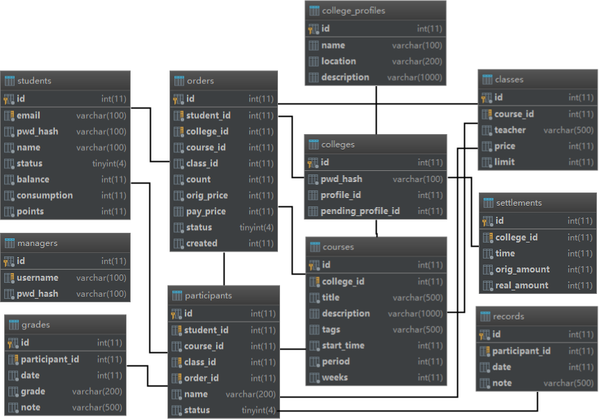

# TrainingCollege 大作业文档
> 151250091 梁家铭

## 一、数据库设计

### 1、ER图

### 2、数据库表

#### 表 classes (班级)
| 列名 | 类型 | 说明 |
| - | - | - |
| id | int(11) NOT NULL AUTO_INCREMENT | 班级 ID |
| course_id | int(11) NOT NULL | 课程 ID (对应 courses.id) |
| teacher | varchar(500) NOT NULL | 教师 |
| price | int(11) NOT NULL | 价格 |
| limit | int(11) NOT NULL | 班级人数 |

#### 表 colleges (机构)
| 列名 | 类型 | 说明 |
| - | - | - |
| id | int(11) NOT NULL AUTO_INCREMENT | 机构编号 |
| pwd_hash | varchar(100) NOT NULL | 密码哈希 |
| profile_id | int(11) DEFAULT NULL | 当前信息 ID (对应 college_profiles.id) |
| pending_profile_id | int(11) DEFAULT NULL | 待审批信息 ID (对应 college_profiles.id) |

#### 表 college_profiles (机构信息)
| 列名 | 类型 | 说明 |
| - | - | - |
| id | int(11) NOT NULL AUTO_INCREMENT | 信息 ID |
| name | varchar(100) DEFAULT NULL | 机构名称 |
| location | varchar(200) DEFAULT NULL | 机构地点 |
| description | varchar(1000) DEFAULT NULL | 机构简介 |

#### 表 courses (课程)
| 列名 | 类型 | 说明 |
| - | - | - |
| id | int(11) NOT NULL AUTO_INCREMENT | 课程 ID |
| college_id | int(11) NOT NULL | 机构 ID (对应 colleges.id) |
| title | varchar(500) NOT NULL | 课程名 |
| description | varchar(1000) DEFAULT NULL | 课程简介 |
| tags | varchar(500) DEFAULT NULL | 课程类别 |
| start_time | int(11) NOT NULL | 开课时间 |
| period | int(11) NOT NULL | 每周课时 |
| weeks | int(11) NOT NULL | 课程周数 |

#### 表 grades (成绩)
| 列名 | 类型 | 说明 |
| - | - | - |
| id | int(11) NOT NULL AUTO_INCREMENT | 成绩 ID |
| participant_id | int(11) NOT NULL | 听课人 ID (对应 participants.id) |
| date | int(11) NOT NULL | 日期 |
| grade | varchar(200) NOT NULL | 成绩 |
| note | varchar(500) NOT NULL | 备注 |

#### 表 managers (经理)
| 列名 | 类型 | 说明 |
| - | - | - |
| id | int(11) NOT NULL AUTO_INCREMENT | 经理 ID |
| username | varchar(100) NOT NULL | 用户名 |
| pwd_hash | varchar(100) NOT NULL | 密码哈希 |

#### 表 orders (订单)
| 列名 | 类型 | 说明 |
| - | - | - |
| id | int(11) NOT NULL AUTO_INCREMENT | 订单 ID |
| student_id | int(11) NOT NULL | 学员 ID (对应 students.id) |
| college_id | int(11) NOT NULL | 机构 ID (对应 colleges.id) |
| course_id | int(11) NOT NULL | 课程 ID (对应 courses.id) |
| class_id | int(11) NOT NULL | 班级 ID (对应 classes.id) |
| count | int(11) NOT NULL | 人数 |
| orig_price | int(11) NOT NULL | 原价 |
| pay_price | int(11) DEFAULT NULL | 实际支付价格 |
| status | tinyint(4) NOT NULL | 状态 |
| created | int(11) NOT NULL | 下单时间 |

#### 表 participants (听课人)
| 列名 | 类型 | 说明 |
| - | - | - |
| id | int(11) NOT NULL AUTO_INCREMENT | 听课人 ID |
| student_id | int(11) NOT NULL | 学员 ID (对应 students.id) |
| course_id | int(11) NOT NULL | 课程 ID (对应 courses.id) |
| class_id | int(11) NOT NULL | 班级 ID (对应 classes.id) |
| order_id | int(11) NOT NULL | 订单 ID (对应 orders.id) |
| name | varchar(200) NOT NULL | 姓名 |
| status | tinyint(4) NOT NULL | 状态 |

#### 表 records (听课记录)
| 列名 | 类型 | 说明 |
| - | - | - |
| id | int(11) NOT NULL AUTO_INCREMENT | 记录 ID |
| participant_id | int(11) NOT NULL | 听课人 ID (对应 participants.id) |
| date | int(11) NOT NULL | 听课日期 |
| note | varchar(500) NOT NULL | 备注 |

#### 表 settlements (结算记录)
| 列名 | 类型 | 说明 |
| - | - | - |
| id | int(11) NOT NULL AUTO_INCREMENT | 记录 ID |
| college_id | int(11) NOT NULL | 机构 ID (对应 colleges.id) |
| time | int(11) NOT NULL | 结算时间 |
| orig_amount | int(11) NOT NULL | 原金额 |
| real_amount | int(11) NOT NULL | 结算金额 |

#### 表 students (学员)
| 列名 | 类型 | 说明 |
| - | - | - |
| id | int(11) NOT NULL AUTO_INCREMENT | 学员 ID |
| email | varchar(100) NOT NULL | 邮箱地址 |
| pwd_hash | varchar(100) NOT NULL | 密码哈希 |
| name | varchar(100) NOT NULL | 姓名 |
| status | tinyint(4) NOT NULL | 状态 |
| balance | int(11) NOT NULL DEFAULT 0 | 余额 |
| consumption | int(11) NOT NULL DEFAULT 0 | 总消费额 |
| points | int(11) NOT NULL DEFAULT 0 | 积分 |

## 二、架构设计

### 1、项目结构

### 2、后端框架
- Web 服务器使用自主开发的 [TomPuss](https://github.com/DeepAQ/Autumn/blob/master/tompuss)
- MVC 架构使用自主开发的 [AutumnREST](https://github.com/DeepAQ/Autumn/blob/master/autumn-rest) 框架
- 数据层使用 MyBatis 框架

### 3、前端框架
前端使用了 Vue.js 框架和 iView 组件库，并采用 Webpack 打包。

## 三、类设计

### 1、各包的类
| 包名 | 类名 | 职责 |
| - | - | - |
| config | JedisConfig | 加载 Redis 配置，为容器注入 Jedis 对象 |
| config | MyBatisConfig | 读取 MyBatis 配置文件，为容器注入 SqlSessionFactory 对象 |
| config | Sensitive | 存放敏感配置信息 |
| controller | *Controller | Web MVC 控制器 |
| domain.dto | *Dto | 前后端数据传输类 |
| domain.entity | * | 持久化实体类 |
| domain.enumeration | UserType | 区分已登录用户的类型 |
| mapper | *Mapper | MyBatis 映射器类 |
| service | *Service | 业务逻辑类 |
| support.annotation | JWTClaim | 用户认证所需要使用的注解 |
| support.aspect | ExceptionHandlerAdvice | 统一的异常处理器 |
| support.exception | ServiceException | 业务逻辑层异常类 |
| support.filter | CorsFilter | 用于支持跨域访问的过滤器 |
| support.resolver | JWTClaimResolver | 用户认证所使用的参数解析器 |
| util | HashUtil | 密码哈希工具类 |
| util | JWTUtil | JWT 签名及验证工具类 |
| util | MailUtil | 邮件发送工具类 |

### 2、前端的各页面
前端为单页面应用，采用组件化开发，详情参考前端代码。

## 四、其他

### 1、开发环境
- JDK 8
- MySQL/MariaDB 数据库
- Redis (用于解决并发报名及订单过期问题)

### 2、开发心得体会
自己造框架的过程很痛苦，但是用起来感觉很好。
